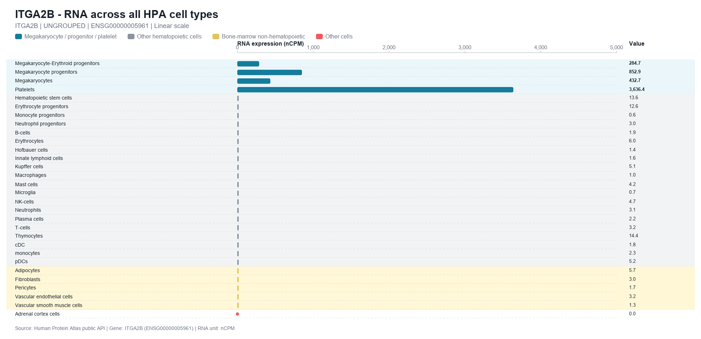
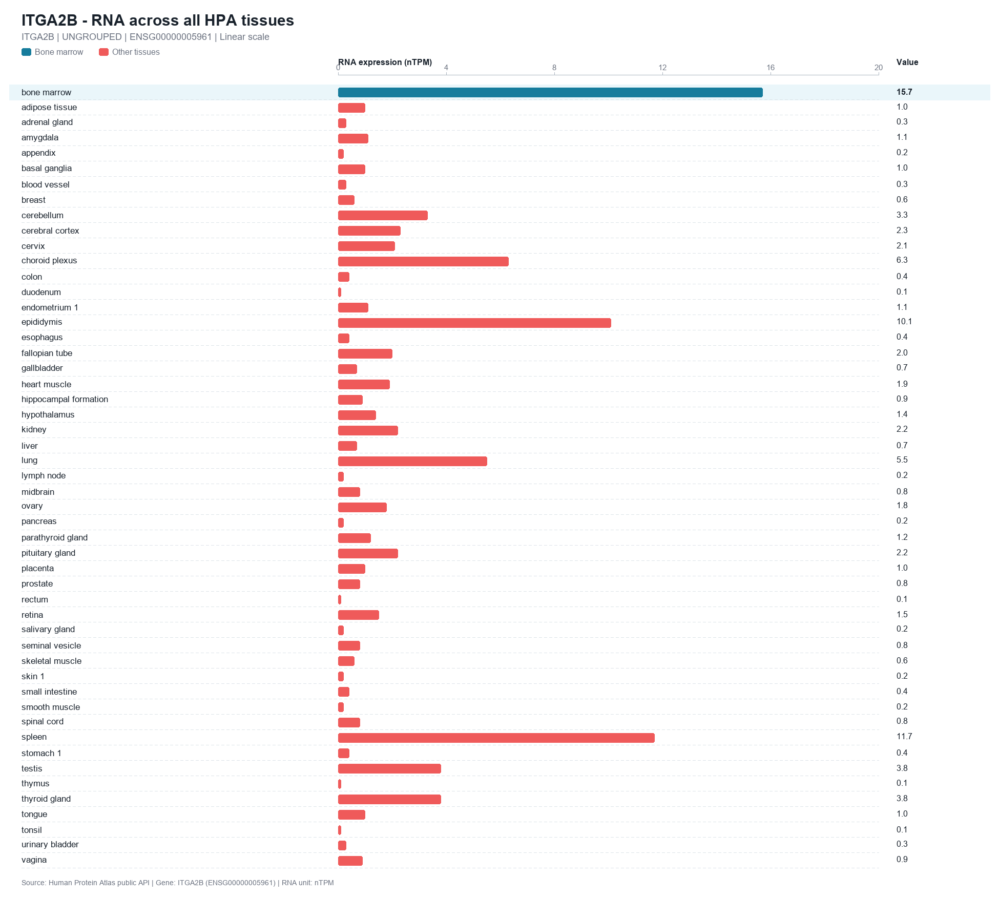

# scrnaseq-gene-specificity-screen

**Screen a gene list for cell-type-specific expression using Human Protein Atlas single-cell RNA-seq** — 154 cell types (nCPM) and 51 tissues (nTPM). No registration, no API key.



*Real output: `ITGA2B` across HPA cell types. The chart is cropped to the 30 most relevant rows purely so this page stays readable — **the pipeline always plots all 154 cell types**, ordered with your configured groups first. The whole megakaryocyte lineage is elevated (Platelets 3,636 nCPM, Megakaryocyte progenitors 853, Megakaryocytes 433, Megakaryocyte-Erythroid progenitors 285) while every other cell type stays below 102. → [full 154-row chart](docs/demo_itga2b_cell_types_full.png) · [all 51 tissues](docs/demo_itga2b_tissues.png)*

For every gene in your list the pipeline downloads the HPA RNA matrices, finds the peak-expressing cell type, and selects the genes whose **peak cell type falls inside your target cell-type group** (by default the megakaryocyte lineage). It writes per-cell-type and per-tissue bar charts plus an Excel/TSV report. It ships as an agent skill (`SKILL.md`) and every step is also a plain Python CLI.

## Install

**As a Python CLI**

```bash
pip install -r requirements.txt   # requests, openpyxl, Pillow
```

Requires Python 3.9+ and network access to `www.proteinatlas.org`.

**As an agent skill** — clone this repository into the skills directory your agent scans, so that the repository root becomes the skill folder:

```bash
# Claude Code — personal skills, available in every project
git clone https://github.com/Sculptor815/scrnaseq-gene-specificity-screen.git \
    ~/.claude/skills/scrnaseq-gene-specificity-screen

# Codex — personal skills, available in every project
git clone https://github.com/Sculptor815/scrnaseq-gene-specificity-screen.git \
    ~/.agents/skills/scrnaseq-gene-specificity-screen
```

Per project instead of per user: clone into `.claude/skills/` (Claude Code) or `.agents/skills/` (Codex, which scans `.agents/skills` from the working directory up to the repository root).

`SKILL.md` must stay at the top level of the skill folder, and the folder name should match the `name` field in its frontmatter. Any runtime that discovers `SKILL.md` directory bundles works — just point its skills directory at this folder.

## Quick start

```bash
# 1. Download the expression matrices (resumable; raw batches cached in out/cache/)
python scripts/step1_fetch_hpa.py --gene-list genes.xlsx --output-dir out/ --config config.json

# 2. Draw two plots per gene (per cell type / per tissue) and merge grouping columns
python scripts/step2_plot_and_merge.py --gene-list genes.xlsx \
    --hpa-excel out/HPA_RNA_expression.xlsx --output-dir out/ --config config.json --workers 4

# 3. Screen for cell-type-specific expression
python scripts/screen_specificity.py --hpa-excel out/HPA_RNA_expression.xlsx \
    --config config.json --out-dir out/
```

Try it on the bundled example first — 6 genes, about a minute:

```bash
python scripts/step1_fetch_hpa.py --gene-list examples/genes.example.csv --output-dir out/ --config config.json
python scripts/step2_plot_and_merge.py --gene-list examples/genes.example.csv \
    --hpa-excel out/HPA_RNA_expression.xlsx --output-dir out/ --config config.json
python scripts/screen_specificity.py --hpa-excel out/HPA_RNA_expression.xlsx --config config.json --out-dir out/
```

That example (`PF4, PPBP, ITGA2B, GP9, VWF, ACTB`) produces [examples/selected_genes.example.tsv](examples/selected_genes.example.tsv):

| gene | driver | top cell type | top value (nCPM) | specificity ratio |
|---|---|---|---|---|
| GP9 | MK_lineage | Platelets | 3990.4 | 132.6 |
| ITGA2B | MK_lineage | Platelets | 3636.4 | 35.8 |
| PF4 | MK_lineage | Platelets | 1436.7 | 2873.4 |
| PPBP | MK_lineage | Platelets | 141.1 | 201.6 |
| ACTB | MK_lineage | Megakaryocytes | 22056.0 | **1.30** |
| VWF | — | *(peak outside the target group)* | — | — |

Two instructive rows: `ACTB` is selected purely because its peak happened to land inside the group, but its ratio of 1.3 shows it is not specific (read the ratio, not the absolute value); `VWF` peaks in endothelial cells, so it is **not** selected even though it is a platelet protein. `--workers` matters for large lists: 2 PNGs per gene, so 4,000 genes ≈ 8,000 images (~10 min with `--workers 4`).

## Input

A CSV / TSV / XLSX file with a `gene` (or `symbol`, `query_gene`) column. Optional grouping columns such as `GEP`, `GEP_zscore`, `loading` are carried through to the final workbook and used to organize the plot directories.

## Configuration

Copy `assets/config.example.json` and edit:

| Key | Meaning |
|---|---|
| `specificity_groups` | Ordered map of group name → HPA cell-type names. The first group containing a gene's peak cell type becomes its `driver`. Put the narrowest lineage first. Names must match HPA column headers exactly (case-sensitive). |
| `reference_tissue` | Tissue reported as auxiliary annotation (e.g. `"bone marrow"`). Never used as a filter. |
| `borderline_fraction` | Genes whose best in-group value ≥ this fraction (default 0.85) of the overall peak are listed as borderline for manual review. |

The example config defines the megakaryocyte lineage + wider hematopoietic set used in the
original study; swap in any cell types to retarget the screen.

## Output

- `HPA_RNA_expression.xlsx` — sheets `RNA_Cell_Types` (154 nCPM columns) and `RNA_Tissues` (51 nTPM columns)
- `gene_plots/<group>/<GENE>/` — `*_01_RNA_every_cell_type.png`, `*_02_RNA_every_tissue.png`
- `HPA_RNA_with_GEP.xlsx` — expression workbook merged with grouping columns
- `selected_genes.tsv` — selected genes with `driver`, peak cell type, in-group vs. out-group
  maxima, specificity ratio, and reference-tissue rank
- `screening_summary.json` — counts per driver group and the borderline-gene list
- `validation_step1.json` / `validation_step2.json` — automated integrity checks

## Screening rule

The **single-cell-type peak is the only criterion**; tissue specificity is annotation, not a
filter — a gene can be highly specific at the cell-type level without being tissue-specific
(tissues are mixtures, so cell-type specificity is diluted). See
[references/specificity-rules.md](references/specificity-rules.md) for the rationale and
[references/hpa-api.md](references/hpa-api.md) for HPA API behavior and known pitfalls
(duplicate gene symbols mapping to multiple Ensembl entries, unmatched symbols, retry and
write-permission handling).

Tissue values are reported for cross-validation only — here is the same `ITGA2B` across all 51 tissues (bone marrow 15.7 nTPM, rank 1 of 51; spleen 11.7; epididymis 10.1; everything else below 6.4):



## Notes & limitations

- Symbols not found in HPA (~0.4%, usually aliases/deprecated symbols) are left blank and
  listed under `missing_genes` in the run metadata printed by step 1.
- A few symbols (e.g. `MATR3`, `POLR2J3`) map to multiple Ensembl entries in HPA; the matrices
  keep one record per symbol, so the `Ensembl` value for those symbols depends on which record the
  API last returned, and no warning is emitted — check it manually when the exact ID matters.
- A gene is excluded from the screen if any cell-type value is missing (a blank cell means HPA had
  no measurement); such rows are skipped rather than treated as zero.
- A cell-type name that does not exist in HPA is silently ignored, so a typo shrinks or empties a
  group without an error. Check the names against the `RNA_Cell_Types` header after step 1.
- Plot colours and legend labels are keyed to the megakaryocyte / hematopoietic example and are
  fixed in `scripts/hpa_pipeline/plots.py`.
- Downstream analyses performed in the original study (STRING networks, per-gene PubMed
  literature scans, review slide decks) are not part of this skill.

## Data source & citation

Expression data come from the Human Protein Atlas public API
(`https://www.proteinatlas.org/api/search_download.php`) and are **not** redistributed here — the
pipeline downloads them at run time. HPA content is licensed
[CC BY 4.0](https://www.proteinatlas.org/about/licence); please cite HPA and the datasets you used
when publishing results:

- Uhlén M et al. *Tissue-based map of the human proteome.* Science (2015). DOI: 10.1126/science.1260419
- Karlsson M et al. *A single-cell type transcriptomics map of human tissues.* Sci Adv (2021). DOI: 10.1126/sciadv.abh2169

## License

The code in this repository is released under the MIT License (see [LICENSE](LICENSE)); that
license does not cover the HPA expression data downloaded by the pipeline.
